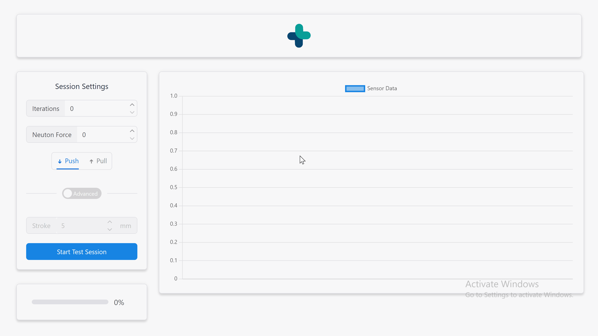

<div align="center">


# QA Force Tester User Interface

<!-- 

 -->

[Overview](#scroll-overview)
•
[Screenshot](#rice_scene-screenshot)
•
[Demo](#dvd-demo)
•
[Documentation](#blue_book-documentation)

</div>

<!-- ## :bookmark_tabs: Menu

- [Overview](#scroll-overview)
- [Screenshot](#rice_scene-screenshot)
- [Demo](#dvd-demo)
- [Documentation](#blue_book-documentation)
- [Requirements](#exclamation-requirements)
- [Installation and usage](#floppy_disk-installation-and-usage)
  - [Dependencies and libs](#heavy_check_mark-dependencies-and-libs)
  - [Folder Structure](#open_file_folder-folder-structure)
- [Release History](#gift-release-history)
- [License](#memo-license)
- [Author](#smiley_cat-author) -->

## :scroll: Overview

This project was created for a QA operation testing at "Itamar Medical".

The project enables communication and visualization with 2 serial devices (Arduino, and a digital force gauge). The end goal is to produce a friendly user interface which every one can operate

## :computer: Screenshot


## :dvd: Demo



## :exclamation: Requirements

- [Node.js](https://nodejs.org/en/download/)

## :floppy_disk: Installation and usage

```console
$ git clone https://github.com/GuyNoimark/tester-controller
$ cd tester-controller/src
$ npm install --force
$ npm run start
```

### Build .exe

```console
$ npm run build
$ electron-packager ./ --platform=win32 --arch=x64
```

<!--
### :rotating_light: Tests

```
$ npm run test
``` -->

### :heavy_check_mark: Dependencies and libs

- [React](https://reactjs.org/)
- [Electron](https://www.electronjs.org/)
- [SerialPort](https://serialport.io/)

### :open_file_folder: Folder Structure

```
.
├── build         # React app final build
├── node_modules  # Dependencies
├── assets        # Assets for the project
├── src           # Project source code
├── .gitignore
├── LICENSE
└── README.md
```

## :gift: Release History

TBD

- 0.0.0
  - Init the project

## :memo: License

The [MIT License]() (MIT)

## :email: Authors

- [@TomBavarsky](https://github.com/tombavarsky)
- [@GuyNoimark](https://github.com/GuyNoimark)
